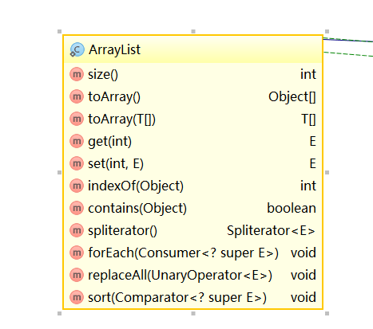

## Arrays.asList() 不可修改

使用Arrays.asList(T... a)得到list集合:
```
 public static void main(String[] args) {
        List<String> list = Arrays.asList("a","b");
        list.add("c");
    }
```
上面的程序会出现java.lang.UnsupportedOperationException，这样的异常

查看asList的源码：
```
  public static <T> List<T> asList(T... a) {
        return new ArrayList<>(a);
    }
```
发现返回是ArrayList,百思不得其解。点开new ArrayList的实现：
```
 private static class ArrayList<E> extends AbstractList<E>
        implements RandomAccess, java.io.Serializable
    {
        private static final long serialVersionUID = -2764017481108945198L;
        private final E[] a;

        ArrayList(E[] array) {
            a = Objects.requireNonNull(array);
        }
        //部分代码
    }
    
```
这里的是ArrayList是Arrays静态的一个内部类，而它所包含的方法，如下图：

发现并没有自己add和remove方法。那么它调用的就是父类的add，和remove方法，而在父类中：
```
public void add(int index, E element) {
    throw new UnsupportedOperationException();
}

public E remove(int index) {
    throw new UnsupportedOperationException();
}
```
从这里可以看出，父类对新增和删除并没有任何逻辑，是直接抛出异常的，这也对Arrays.asList得到的集合类，执行新增和删除操作会抛出异常的真正原因所在。

###总结：
对于Arrays.asList()所得到的集合是一个长度不变的集合，没有add和remove方法。