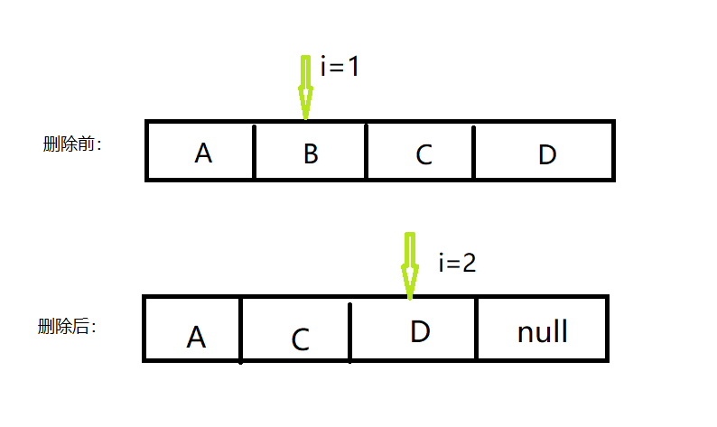

## Java 容器遍历中的删除

    之前只是模糊的知道，在java中使用for、增强for循环时不能进行删除操作。但是一直不知道是为什么。
    直到，最近在工作当中遇到，就决定分析一下这是什么原因。

#### 普通for循环
```
    List<String> list = new ArrayList<>();
    list.add("a");
    list.add("b");
    list.add("c");
    list.add("d");
    for (int i = 0; i < list.size(); i++) {
        System.out.println(list.get(i));
        if ("b".equals(list.get(i))) {
            list.remove(i);
        }
    }
```
这是使用普通for循环，以上的结果为a、b、d。 元素c没有被打印出来。是不是错将元素c删除了呢？几次修改删除的元素之后发现，永远都是被删除的下一个元素。不能被打印出来。这是为什么呢，看看remove的源码：
```
    public E remove(int index) {
        rangeCheck(index);

        modCount++;
        E oldValue = elementData(index);

        int numMoved = size - index - 1;
        if (numMoved > 0)
            System.arraycopy(elementData, index+1, elementData, index,
                             numMoved);
        elementData[--size] = null; // clear to let GC do its work

        return oldValue;
    }
```
以上是ArrayList中的remove方法。由以上可以看出删除实际上是调用arraycopy的方法，将需要被删除的元素给覆盖掉了。所以当上面的remove执行完成的时候数组中实际的元素是这样的：['a','c','d'],确实是将数组的元素给删除了。但是有问题的也就是在这里：**元素删除之后，循环变量的下标也加1了，但是现在c元素是在之前b元素的下标上**。所以下一个遍历的元素就是dle，这样就跳过了元素c。如下图：


也正是因为如此，如果在删除元素的时候我们不让索引下标自增的话就不会出现这样的情况,如下：
```
List<String> list = new ArrayList<>();
list.add("a");
list.add("b");
list.add("c");
list.add("d");
for (int i = 0; i < list.size();) {
    System.out.println(list.get(i));
    if ("b".equals(list.get(i))) {
        list.remove(i);
        continue;
    }
    i++;
}
```
以上代码是可以正确输出[a,b,c,d]的。

####增强for循环
增强for，代码如下：
```
List<String> list = new ArrayList<>();
list.add("a");
list.add("b");
list.add("c");
list.add("d");
for(String s: list) {
    System.out.println(s);
    if ("b".equals(s)) {
        list.remove(s);
    }
}
```
结果会抛出ConcurrentModificationException这样的异常。增强for循环实际上是调用的迭代器做遍历的，所以上面的代码和下面的是一样的：
```
 ArrayList<String> list = new ArrayList<>();
list.add("a");
list.add("b");
list.add("c");
list.add("d");

Iterator<String> it = list.iterator();
while (it.hasNext()) {
    String s = it.next();
    System.out.println(s);
    if ("b".equals(s)) {
        list.remove(s);
    }
}
```

那为什么会使用迭代器遍历就会出现ConcurrentModificationException这样的异常呢。看看ArrayList里面迭代器的实现：
```
 private class Itr implements Iterator<E> {
        int cursor;       // index of next element to return
        int lastRet = -1; // index of last element returned; -1 if no such
        int expectedModCount = modCount;

        public boolean hasNext() {
            return cursor != size;
        }

        @SuppressWarnings("unchecked")
        public E next() {
            /**
            * 迭代器的next往下遍历的时候会做expectedModCount和modCount的校验，如果不相等就会抛出
            * ConcurrentModificationException异常，而我们刚刚调用的是ArrayList的
            * remove操作 modCount会进行++操作，从而就会造成modCount和expectedModCount不相等
            */
            checkForComodification();
            int i = cursor;
            if (i >= size)
                throw new NoSuchElementException();
            Object[] elementData = ArrayList.this.elementData;
            if (i >= elementData.length)
                throw new ConcurrentModificationException();
            cursor = i + 1;
            return (E) elementData[lastRet = i];
        }

        public void remove() {
            if (lastRet < 0)
                throw new IllegalStateException();

            checkForComodification();

            try {
                ArrayList.this.remove(lastRet);
                /**
                * 在迭代器中的remove，会调用ArrayList中的remove，但是之后会进行当前
                * 遍历的索引值又赋值给cursor，所以我们如果调用的是迭代器的remove是能
                * 遍历所有元素的
                */
                cursor = lastRet;
                lastRet = -1;
                expectedModCount = modCount;
            } catch (IndexOutOfBoundsException ex) {
                throw new ConcurrentModificationException();
            }
        }

        final void checkForComodification() {
            if (modCount != expectedModCount)
                throw new ConcurrentModificationException();
        }
    }
```
在使用迭代器进行遍历期间，是不允许对容器进行额外的增删改操作的。所以像上面那样调用ArrayList的remove就会抛出异常。那么怎么解决这个问题呢？使用迭代器的remove，如下：
```
ArrayList<String> list = new ArrayList<>();
list.add("a");
list.add("b");
list.add("c");
list.add("d");

Iterator<String> it = list.iterator();
while (it.hasNext()) {
    String s = it.next();
    System.out.println(s);
    if ("b".equals(s)) {
        // 使用迭代器的删除方法
        it.remove();
    }
}
```
这段代码和之前唯一不一样的地方就在于remove的时候使用迭代器的remove。原因和上面代码分析所述，在进行元素删除之后会将当前的索引下标重新赋值给游标cursor，所以遍历丢失。后面还有进行expectedModCount = modCount;所以也不会抛出ConcurrentModificationException异常。

#### 总结
以上分析的是ArrayList，其他java容器类，类似。

在java容器中的遍历：
 - 增强for不要做元素删除、添加等操作
 - 普通for循环，如果删除操作需要自己控制当前循环的索引，或者从后往前进行
